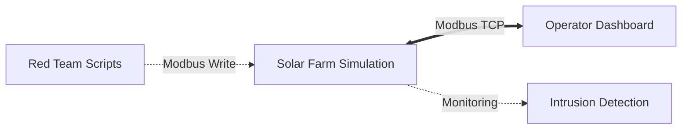

# Renewable Energy SCADA Attack & Defence Lab (Solar Farm)


> **A fully simulated OT/ICS cyber range demonstrating solar farm SCADA security, attacks, and defensive monitoring.**

## 📖 Overview
As the world transitions to renewable energy, the security of Distributed Energy Resources (DER) is paramount. This lab provides a safe, local environment to explore **IEC 62443** concepts, **Modbus TCP** vulnerabilities, and **SOCI Act** risk principles.

It simulates a complete Solar Farm control loop:
- **Physics**: Solar irradiance, Battery SoC, Inverter efficiency, Grid frequency.
- **Control**: Modbus TCP Server (PLC).
- **Operation**: Web-based HMI.
- **Security**: Integrated Red Team (Attack) and Blue Team (Defence) tools.

## 🏗 Architecture



See [docs/ARCHITECTURE.md](docs/ARCHITECTURE.md) for deep dive.

## 🚀 Quick Start

### Option A: Docker (Recommended)
```bash
docker-compose up --build
```
- **HMI**: [http://localhost:8000](http://localhost:8000)
- **Modbus**: Port 5020

### Option B: Local Python
```bash
# 1. Install dependencies
pip install -r requirements.txt

# 2. Start Simulation
python -m simulation.modbus_server &

# 3. Start HMI
uvicorn hmi.app:app --reload --port 8000
```

## ⚔️ Scenarios

### 🔴 Red Team (Attack)
Scripts in `attacker/` demonstrate common ICS attacks:
1.  **DoS (Export Limit)**: `python attacker/write_attack.py` - Sabotages power generation.
2.  **Replay Attack**: `python attacker/replay_attack.py` - Injects fake solar data.
3.  **MITM**: `python attacker/mitm_sim.py` - Spoofs grid voltage.
4.  **Recon**: `python attacker/recon.py` - Maps registers.

See [docs/RED_TEAM_PLAYBOOK.md](docs/RED_TEAM_PLAYBOOK.md).

### 🔵 Blue Team (Defence)
1.  **IDS**: Monitors traffic for anomalies (runs automatically).
2.  **Defence Mode**: Toggle in HMI to auto-revert malicious changes.
3.  **Forensics**: Analyze `ids_events.json`.

See [docs/BLUE_TEAM_PLAYBOOK.md](docs/BLUE_TEAM_PLAYBOOK.md).

## 📂 Repository Structure
```
solar_farm_scada_lab/
├── simulation/         # Physics models & Modbus Server
├── hmi/                # Web Dashboard (FastAPI + Chart.js)
├── attacker/           # Offensive tools
├── defender/           # IDS & Logging
├── docs/               # Detailed documentation
├── tests/              # Unit & Integration tests
└── docker-compose.yaml # Orchestration
```

## 📜 License
MIT License. See [LICENSE](LICENSE) for details.
