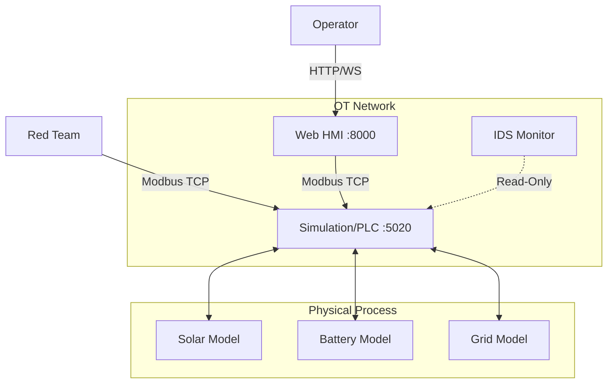

# System Architecture

## Overview
The **Renewable Energy SCADA Lab** simulates a modern solar power plant's Operational Technology (OT) network. It is designed to demonstrate the interaction between physical processes, industrial control systems, and human operators, as well as the vulnerabilities inherent in these communications.

## Components

### 1. Simulation Core (The "Plant")
- **Role**: Acts as the Programmable Logic Controller (PLC) and the physical plant.
- **Technology**: Python, `pymodbus`.
- **Physics Models**:
    - **Solar Array**: Generates power based on time-of-day and simulated irradiance.
    - **Inverter**: Converts DC to AC, manages grid connection status.
    - **Battery**: Stores excess energy, manages State of Charge (SoC).
    - **Grid**: Simulates grid voltage and frequency response to power injection.
- **Interface**: Modbus TCP (Port 5020).

### 2. Human Machine Interface (HMI)
- **Role**: Operator workstation for monitoring and control.
- **Technology**: FastAPI (Backend), HTML/JS/Chart.js (Frontend).
- **Communication**: Polls Modbus TCP server every 1s via `pymodbus`. Pushes updates to frontend via WebSockets.
- **Features**:
    - Real-time graphs.
    - Control buttons (Inverter On/Off, Export Limit).
    - Alarm display.

### 3. Intrusion Detection System (IDS)
- **Role**: Passive/Active monitoring of the OT network.
- **Technology**: Python.
- **Logic**:
    - Monitors Modbus registers for anomalies (e.g., Export Limit = 0 while generating).
    - Checks for physics violations (e.g., Solar Output > Capacity).
    - Logs events to `ids_events.json`.

## Network Diagram (Logical)

## Data Flow
1. **Normal Operation**:
   - `Solar Model` updates internal state.
   - `PLC` exposes state via Holding Registers.
   - `HMI` polls registers -> Updates UI.
   - `Operator` clicks "Stop" -> `HMI` writes to Coil -> `PLC` updates `Inverter Model`.

2. **Attack Scenario**:
   - `Attacker` sends Modbus Write (Func 0x06) to `PLC` Register 3 (Export Limit).
   - `PLC` accepts value (no auth).
   - `Grid Model` constrains output.
   - `IDS` detects anomaly in next poll cycle -> Logs Alert.
